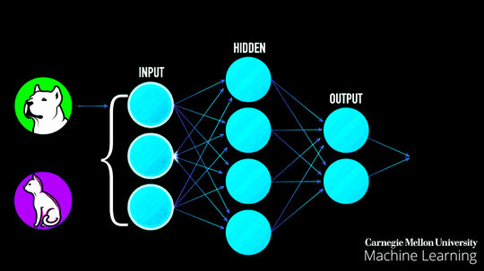

# Hi  :smile: , I'm Abhishek Verma</h1>
### I am Competitive Programmer,Developer and Deep Learning Enthusiast.</h2>

  

 

 

<h1> Know my Technical Skills

<h2 align="left">Programming Languages</h2>

     

 
 
<h2 align="left">Miscellaneous</h2>

       

  

 
<h2 align="left">Know me</h2>

<strong>LinkedIn:</strong> https://www.linkedin.com/in/abhishekverma7887/

<strong>CodeChef:</strong> https://www.codechef.com/users/abhisek_12345

<strong>Codeforces:</strong> https://codeforces.com/profile/Abhishekverma7887

    
